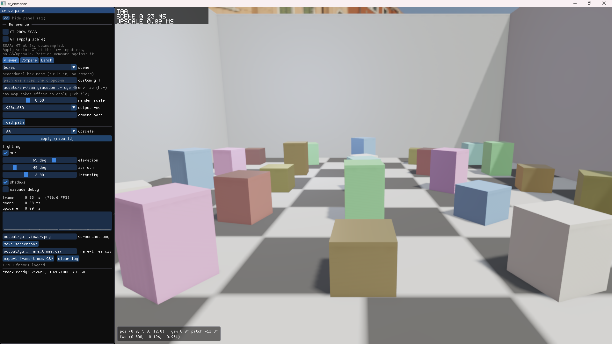
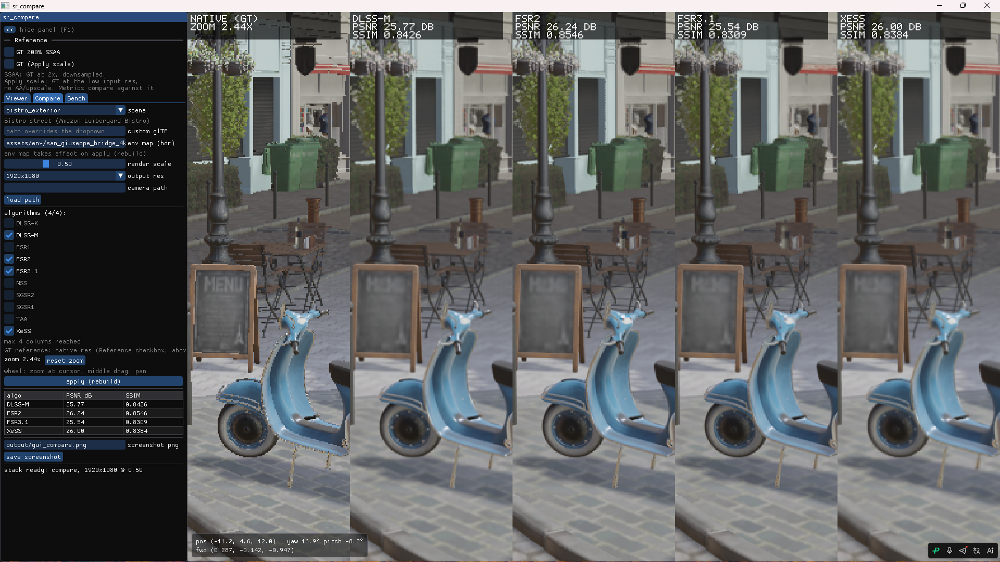

# sr_compare — 超分方案横向对比工具

Vulkan 单后端，在同一场景/同一相机路径下对比多种超分算法的画质与性能。

## 覆盖算法

| 算法 | 类型 | 来源/许可证 |
|---|---|---|
| TAA（自研基线） | 时域 | 本仓库 |
| FSR 1 / 2 / 3.1 | 空间/时域 | AMD FidelityFX SDK 1.1.4（MIT） |
| Intel XeSS | ML（DP4a） | intel/xess（闭源 DLL，Intel Simplified License） |
| NVIDIA DLSS 4.5（Preset K / L / M） | ML（Transformer） | Streamline SDK（框架 MIT；nvngx_dlss.dll 闭源，需 NVIDIA Developer applicationId） |
| Arm NSS v1.0.1（high/mid_low int8） | ML（移动端） | arm/neural-graphics-sdk-for-game-engines（MIT）+ HF 模型（Arm AI Model Community License） |
| SGSR 1 / 2 | 空间/时域（移动端） | SnapdragonGameStudios/snapdragon-gsr（BSD-3-Clause） |

Arm NSS 在 PC 上经 Vulkan ML Emulation Layer 软件模拟推理，性能数字不代表真机。

## 渲染器

- Deferred PBR：Heitz 高度相关 GGX + Hammon 2017 漫反射（不用 Lambert）、punctual
  灯、完整 IBL（irradiance + prefiltered specular + BRDF LUT）+ Fdez-Aguera
  多散射补偿、法线/ORM/AO/自发光贴图、MASK 镂空、mipmap + 16x 各向异性、
  合并场景缓冲
- 天空：Hillaire 2020 大气（transmittance/multiscatter LUT）渲进 IBL env cube，
  太阳方向由场景预设驱动（CLI `--sun-elev` / `--sun-az`）；`--env-map <hdr>`
  可换回静态 equirect HDR。Bistro 黄昏预设的太阳色来自大气模型
- Clustered shading：64 px tile × 24 指数深度 slice，SSBO 最多 1024 盏
  点光 + 聚光灯（每 cluster ≤64），GPU 上逐 cluster 分配；CSM 太阳不走 cluster
- 阴影：CSM 太阳（4 × 2048² 级联，包围球稳定，IGN dither 级联过渡）、聚光灯
  阴影 atlas（4096²，16 × 1024² tile，逐帧按重要性选灯）、太阳屏幕空间接触阴影
  （`--no-contact-shadows`）
- SSR：全屏不透明 Hi-Z 锥体步进，按 roughness 采颜色 mip，能量守恒地替换 IBL
  specular 项，temporal EMA 累积（默认关；`--ssr` 开启，`--ssr-strength <0..1>`
  缩放强度，默认 0.6）。反射回退链：SSR → 烘焙局部反射
  探针（box projection、双探针混合；`--bake-probes` 离线烘焙）→ env
- GTAO（XeGTAO 风格深度 mip 采样 + temporal 累积；Jimenez 2016 3 切片 ×
  每侧 3 步 + 5×5 深度双边滤波）
- 自动曝光：log 亮度直方图 + EV 平滑，固定 dt 确定性，给 TAA/超分喂真实
  preExposure；CLI `--exposure <f>` 切回手动
- TAA：YCoCg 历史 clip、深度 disocclusion、自适应 alpha、RCAS 锐化
- 体积雾：froxel 网格（注入/光照/temporal/march/composite 五 pass），复用 CSM +
  cluster 灯光，god rays；介质参数由场景预设携带（`--no-volfog`）
- 后处理链：阈值提取 bloom 金字塔（13-tap 降采样 / tent 上采样；所有模式
  默认关，用 `--bloom` 或 GUI checkbox 显式打开）、HDR 运动模糊（McGuire
  2012 tile-max gather）、景深（UE4 scatter-as-gather CoC，中心像素自动对焦）
  ——运动模糊与景深在所有模式下默认关闭，用 `--motion-blur` / `--dof`
  （viewer + compare）或 GUI checkbox 显式打开；LR/GT/GT-SSAA 三条路径同算法
  同参数，帧号驱动噪声保证确定性
- 色彩分级：简化 ACEScc log 域（色温/tint/对比度/饱和度，CLI
  `--temperature`/`--tint`/`--contrast`/`--saturation`，GUI 滑条）+ `.cube`
  3D LUT（`--lut`），CPU 镜像用于 PNG 截图；末端镜头链（色差/污渍/暗角/颗粒，
  `--no-lens-fx`）；HDR 输出探测 HDR10 PQ 再 scRGB，失败回退 SDR（viewer `--hdr`）
- 显示变换：Stephen Hill fitted ACES + gamma 2.2（present / compare compose /
  GPU 指标 / CPU 截图共用同一套）
- 前向透明 pass（lighting 之后、upscale 之前）：电介质橱窗模型（镀膜菲涅尔、
  McGuire clip-space DDA SSR，合成时乘 EnvBRDF）；Bistro 镜面橱窗改用普通玻璃
  菲涅尔（F0 0.04）并使用**平面反射**：每帧选取视野内最近的镜面平面，用镜像相机
  额外渲染一遍不透明 GBuffer + 光照（GBuffer 着色器裁剪平面、AO 置白、无雾无透明；
  `--no-planar-reflections`、engine.toml `[effects] planar_reflections` 或 GUI
  复选框可关闭），橱窗按自身投影采样该图像——对平面反射体精确，含屏幕外内容
  与贴近玻璃物体的背面。其它平面上的橱窗仍走 Hi-Z SSR 回退（已加入实体遮挡处理：
  光线穿到遮挡物背后时按可见前表面凸起推断对称凸体判定命中，朝向相机的光线用精确
  穿出测试），并写平面镜运动矢量（反射内容按虚像点重投影、mask 置 0），
  时域超分在镜头移动时可稳定累积反射；后往前排序、写相机运动矢量与
  半透明覆盖度 mask
- 覆盖度 mask 接入了所有官方支持的接口：TAA（历史权重）、FSR2/FSR3（reactive + T&C
  mask）、DLSS（bias-current-color / reactive / transparency hint）、XeSS（responsive
  pixel mask）。NSS 与 SGSR2 无此输入。
- 动画：glTF 节点树、动画与 GPU 蒙皮（双缓冲 joint palette），姿态按
  帧号 × 固定 dt 采样（不用墙钟）；per-object 运动矢量；boxes 场景有两个动态盒子
- LOD：meshoptimizer 生成逐 mesh 链（有 `MSFT_lod` 时直接读），按屏幕尺寸切换 +
  hysteresis，磁盘缓存（`SR_LOD=0` 关闭）；GPU 遮挡剔除对照上一帧 Hi-Z 金字塔，
  配合 SSBO 实例化 + indirect draw（`SR_OCCLUSION=0` 关闭，GUI 有 checkbox）
- 贴图：优先加载同名的 BC7 KTX2（`scripts/transcode_textures.py` 离线转码，AMD
  Compressonator），viewer/GUI 交互时细 mip 流送（bench/compare/截图运行为保确定性
  全量上传；`SR_TEX_STREAM=0/1` 强制覆盖）
- 基础设施：VMA 分配器、持久化管线缓存、sync2 屏障、一次性上传走独立 transfer
  队列、轻量 render graph（transient 别名）驱动 viewer 的帧录制
- 参考真值：原生分辨率，可选 200% SSAA（4K→1080p）

## 运行模式

- **gui** — ImGui 界面（Viewer / Compare / Bench 三个标签页）。切场景/算法在工作
  线程异步加载并显示进度浮层，旧画面持续渲染不卡死；分级重建——只改算法不再
  重载场景。侧栏底部有 **Exit** 按钮，走正常窗口关闭路径（完整 Vulkan 清理）。
  SSR 仅限 CLI/engine.toml：GUI 复选框与 Render Graph 节点均锁定（灰显，
  tooltip 指向 `--ssr`）。
- **viewer** — 自由视角单算法全屏预览。
- **compare** — 分栏实时对比：最左栏原生 GT，右侧各算法列，实时 PSNR/SSIM；等比
  裁切、滚轮缩放（指标按可视区域重算）、可选 GT 200% SSAA。
- **bench** — 固定相机路径固定帧数；超分 pass GPU 耗时、整帧耗时/FPS（均值/中位数
  /1% low）、显存占用（VK_EXT_memory_budget），导出 CSV/JSON。





```bat
sr_compare gui
sr_compare viewer --scene sponza --upscaler fsr2
sr_compare compare --scene boxes --upscalers taa,fsr2,xess,dlss-m --render-scale 0.5
sr_compare bench --scene sponza --frames 300 --warmup 60
sr_compare viewer --list-upscalers
```

常用 viewer/compare 开关（无参数运行 `sr_compare <mode>` 看完整文案）：

```
--env-map <hdr>      静态 equirect HDR 作 IBL/天空盒（默认：大气天空）
--sun-elev / --sun-az <deg>   覆盖预设太阳方向
--exposure <f>       手动显示曝光（关闭自动曝光）
--no-shadows / --shadow-debug / --no-contact-shadows
--ssr / --ssr-strength <0..1>
                     打开不透明 SSR（所有模式默认关；--no-ssr 保留兼容旧脚本）
                     并缩放其强度（默认 0.6）
--no-volfog          关闭 froxel 体积雾
--no-planar-reflections
                     关闭平面镜面反射（镜面玻璃退回屏幕空间步进）
--bloom / --no-lens-fx
                     打开 HDR bloom（默认关；--no-bloom 保留兼容旧脚本）/
                     关闭镜头链
--motion-blur / --dof
                     打开运动模糊 / 景深（所有模式默认关；--no-motion-blur /
                     --no-dof 保留兼容旧脚本）
--dof-focus <m> / --dof-fstop <f> / --dof-max-blur <px>
                     DOF 调节（viewer + compare；focus 0 = 屏幕中心自动对焦）
--bake-probes        烘焙反射探针到场景的 .probes 文件后退出
--hdr                HDR 交换链输出（探测 HDR10 PQ 或 scRGB，回退 SDR）
--lut <file.cube>    3D LUT（17^3/33^3），ACES 前 log 域
--temperature <K> / --tint <-1..1> / --contrast <f> / --saturation <f>
```

compare 另有 `--upscalers a,b,...`、`--gt-ssaa`、`--zoom <f>`、
`--zoom-center <u,v>`、`--metric-interval <N>`；bench 另有 `--upscalers`、
`--frames`、`--warmup`、`--out <csv>`。

## 运行时配置（`engine.toml`）

所有模式启动时都会读 exe 旁边的 `engine.toml`（从 `engine.toml.example`
复制即可，该文件随构建拷到 exe 旁并注释了全部参数）。优先级：
**显式 CLI 参数 > engine.toml > 代码默认**——CLI 解析会记录哪些 flag
是用户显式传入的，toml 只填充其余项。文件缺失时完全无行为变化；解析
失败会在 stderr 打印错误并回退默认值；实际生效的键以
`[engine.toml] <mode>: key=value ...` 打印到 stderr，便于脚本核对。

分节：`[window]`（fullscreen——无边框桌面全屏，仅 GUI）、`[renderer]`
（render_scale、hdr、env_map）、`[exposure]`（手动曝光
+ 自动曝光 EV 范围）、`[effects]`（ssr/ssr_strength、shadows、
contact_shadows、volfog、planar_reflections、bloom、motion_blur、lens_fx）、`[lens_fx]`
（GUI 子项）、`[culling]`（occlusion、lod，GUI）、`[dof]`、
`[grading]`（temperature/tint/contrast/saturation/lut）、`[sun]`
（elevation/azimuth）。bench 派生的 viewer 子进程读同一文件，因此同一
engine.toml 下 bench 结果是确定的。

**GUI 支持热重载**（约 1 秒轮询文件修改时间）：逐帧参数——效果开关、
DOF/调色/太阳滑条、曝光、occlusion/lod、HDR 复选框、无边框全屏——即时
生效；render_scale、输出分辨率、env_map、场景、lut 需要 Apply 重建或重启，
热重载会忽略这些键。

**GUI 同时负责写这个文件**：启动时若无 engine.toml，会用当前生效值
（默认值 + CLI 覆盖）自动创建一份；GUI 里改动参数后约 1.5 秒去抖写回
（临时文件 + 原子替换，热重载不会读到半截文件）；运行中删除文件会把
热参数重置为默认并立即重建文件。viewer / compare / bench（含 bench 派生
的子进程）从不写该文件。

## 场景（`--scene`）

- `boxes`（别名 `procedural`）：内置程序化盒子房间，无需外部资产
- `sponza`：Sponza 中庭 — Crytek Sponza 的 Khronos glTF 样例
- `bistro_exterior` / `bistro_interior`：Amazon Lumberyard Bistro（NVIDIA ORCA）
- `<任意 glTF 路径>`：加载自定义场景

`assets/` 不入库。新克隆后按下面获取 Sponza，需要 Bistro 时再转换。

### Sponza

来源：[KhronosGroup/glTF-Sample-Assets](https://github.com/KhronosGroup/glTF-Sample-Assets)
的 `Models/Sponza/glTF/`。模型文件为 Cryengine Limited License Agreement；
文档/metadata 为 CC-BY-4.0。

已经是可加载 glTF，无需转换。在仓库根目录：

```bat
python scripts/fetch_sdks.py --only sponza
```

脚本会浅克隆 Khronos 仓库，并把 glTF 目录拷到 `assets/sponza/`
（`Sponza.gltf` + `Sponza.bin` + 贴图 + 许可证文件）。

### Bistro

来源：[Amazon Lumberyard Bistro，NVIDIA ORCA](https://developer.nvidia.com/orca/amazon-lumberyard-bistro)
（CC-BY 4.0）。从该页下载 FBX 包并解压，本仓库假定的目录结构为：

```
Bistro_v5_2/
  BistroExterior.fbx
  BistroInterior.fbx
  Textures/          :: DDS：*_BaseColor、*_Normal（DirectX Y-）、
                     ::       *_Specular（实际是 ORM：R=AO，G=Roughness，B=Metalness）、
                     ::       *_Emissive
```

需要 **Blender 5.1+**（原生 C++ FBX 导入器；旧 Python 插件遇到该文件里的灯会崩溃）
及其自带的 NumPy。在仓库根目录执行（Git Bash 示例，按本机 Blender / 解压路径改）：

```bash
blender=/c/Program\ Files/Blender\ Foundation/Blender\ 5.1/blender.exe
src=D:/Code/Bistro_v5_2

"$blender" --background --factory-startup --python scripts/convert_bistro_v2.py -- \
    --input "$src/BistroExterior.fbx" --textures "$src/Textures" \
    --output assets/bistro --name BistroExterior

"$blender" --background --factory-startup --python scripts/convert_bistro_v2.py -- \
    --input "$src/BistroInterior.fbx" --textures "$src/Textures" \
    --output assets/bistro --name BistroInterior

python scripts/fixup_bistro_alpha.py
```

`convert_bistro_v2.py` 导出 `GLTF_SEPARATE`（`.gltf` + `.bin` + PNG），带全 PBR
通道：baseColor+alpha、法线 G 通道翻转（DirectX → glTF）、ORM 写成
metallicRoughness + occlusion、自发光、MASK 镂空。随后
`fixup_bistro_alpha.py`（普通 Python，不需要 Blender）修正残留的 alphaMode：
全零 MASK 改回 OPAQUE、真正的玻璃改成带常数 alpha 的 BLEND、被 FBX 标成
BLEND 的不透明材质改回 OPAQUE。结果是 `assets/bistro/BistroExterior.gltf` 与
`BistroInterior.gltf`。

## 从全新克隆构建

1. **环境要求**：Windows 11；Visual Studio（C++ 工作负载，由 vswhere
   自动发现）；CMake ≥ 3.24（PATH 或 VS 自带均可）；Vulkan SDK 1.4+
   （`VULKAN_SDK` 环境变量提供 glslangValidator，用于编译着色器）；
   Python 3.10+ 与 git（供抓取脚本使用）。

2. **抓取 SDK**——把全部第三方 SDK 下载进 `third_party/`（不入库）：
   FidelityFX、XeSS、Streamline、SGSR、Arm NSS、SDL3、ImGui（docking
   分支）、cgltf、stb。

   ```bat
   python scripts/fetch_sdks.py
   ```

   `--only a,b` 只抓子集，`--force` 强制重抓已有项。此步不可省略：
   `third_party/cgltf`、`stb`、`imgui` 是所有构建目标的硬性依赖，
   SDL3 缺失会在 CMake configure 时直接 FATAL_ERROR。CMake 选项
   `SR_WITH_FSR/SGSR/XESS/DLSS/NSS`（默认全部 ON）置 OFF 可去掉对应
   超分 SDK。

3. **构建**：

   ```bat
   build_all.bat          :: 一键 configure + Release 构建
   ```

   exe 生成于 `build/app/Release/sr_compare.exe`。

4. **可选 —— Arm NSS PC 模拟层**（PC 上运行 `--upscaler nss` / NFRU
   帧生成所需）：

   ```bat
   scripts\nss_emu_fetch_deps.bat   :: 需 git + 网络；克隆依赖并打补丁到 build-nss-emu\deps
   scripts\nss_emu_configure.bat    :: 需 Ninja + Python 3 + VS 开发环境
   scripts\nss_emu_build.bat
   ```

   主构建只有在 **CMake configure 时刻**检测到
   `build-nss-emu/build/graph/VkLayer_Graph.dll` 存在，才会把模拟层打包到
   exe 旁（`build/app/Release/nss-emu/`）——因此要么在首次
   `build_all.bat` 之前先构建模拟层，要么事后删除 `build/CMakeCache.txt`
   再重跑 `build_all.bat`。没有模拟层时，请求 nss 的运行会在
   vkCreateInstance 失败（GUI 无条件注入这些层，所以没有模拟层 GUI
   无法启动）；其它超分算法不受影响。

5. **场景资产**不参与构建，仅在运行对应场景时需要（内置 `boxes`
   场景无需任何资产）：`sponza` 由抓取脚本获取
   （`python scripts/fetch_sdks.py --only sponza`，见上文 Sponza 小节）；
   Bistro 需手动下载 ORCA 包并经 Blender 转换（见上文 Bistro 小节）。

6. **运行时说明**：DLSS 需要 NVIDIA Developer 账号申请 applicationId
   （免费），环境变量 `SR_DLSS_APP_ID`；目标机器需要支持 Vulkan 1.3
   的驱动。

### 换机器/整目录拷贝

源码树完全自包含（third_party、assets、着色器全部在树内，CMake 无硬编码路径），
整目录拷贝后装好上述依赖即可 `build_all.bat`。`build*` 目录均为本机缓存可删，
唯一例外：`build-nss-emu/` 内有 NSS 模拟层的依赖（含已打补丁的 git 克隆）。若已
删除，运行 `scripts\nss_emu_fetch_deps.bat`（git + 网络），再
`scripts\nss_emu_configure.bat` + `scripts\nss_emu_build.bat`（另需 Ninja +
Python 3 + VS 开发环境）。缺失时主工程仍能编译，但 `--upscaler nss` / NFRU 会在
vkCreateInstance 失败，GUI（无条件注入模拟层）也无法启动；补齐模拟层后需删除
`build/CMakeCache.txt` 并重跑 `build_all.bat`，让它打包到 exe 旁。

## 打包分发

普通构建不会把 `assets/` 拷进 exe 目录（开发机上 exe 会向上查找到仓库根的
`assets/`）。要让 `build/app/Release/` 成为自包含目录——整体复制即可运行，
无需源码与构建环境——先执行一次资产打包：

```bat
build_all.bat --target package   :: robocopy 增量镜像 assets/（约 3.3GB）
```

打包后的内容：

- `sr_compare.exe` + 全部运行时 DLL（SDL3、XeSS/Streamline/DLSS/NSS、CRT）
- `sr_run_gui.bat`（一键启动 GUI）
- `shaders/`、`nss-emu/`、`assets/`（Bistro 全 PBR 约 3GB，可裁剪）

着色器/资产按 exe 相对路径解析，打包目录从任何工作目录启动都能工作。目标机器
要求：支持 Vulkan 1.3 的显卡驱动；DLSS 需要 RTX 20+（无 RTX 时 DLSS 自动不可用，
其余算法不受影响）。

## 目录结构

- `renderer/` — Vulkan 渲染器核心（设备/帧循环/glTF 场景/deferred GBuffer/lighting/
  透明 pass/GTAO/IBL/相机路径）
- `upscalers/` — 统一超分插件层（`IUpscaler.h` 为契约，各算法一个子目录）
- `compare/`、`bench/`、`gui/`、`app/` — 各前端与入口
- `metrics/` — Python 离线指标复核与 Markdown 报告生成
- `scripts/` — SDK/资产下载、Bistro 转换、贴图转码、NSS 模拟层构建
- `third_party/` — 各 SDK（脚本下载，不入库）

## 许可证

本仓库原创源码为 MIT（见 `LICENSE`）。`third_party/` 下的 SDK 与 `assets/`
下的场景资源仍按各自原许可，详见 `third_party/README.md` 与上文场景说明。

## 注意

- 帧生成（FSR3-FG / XeSS-FG / DLSS-FG）不在本项目范围。
- SGSR 面向移动 Adreno 调优，PC 上性能仅供参考。
- 透明表面在低分辨率渲染后随整帧一起超分（业界标准结构）；逐像素折射/transmission
  有意未实现。
